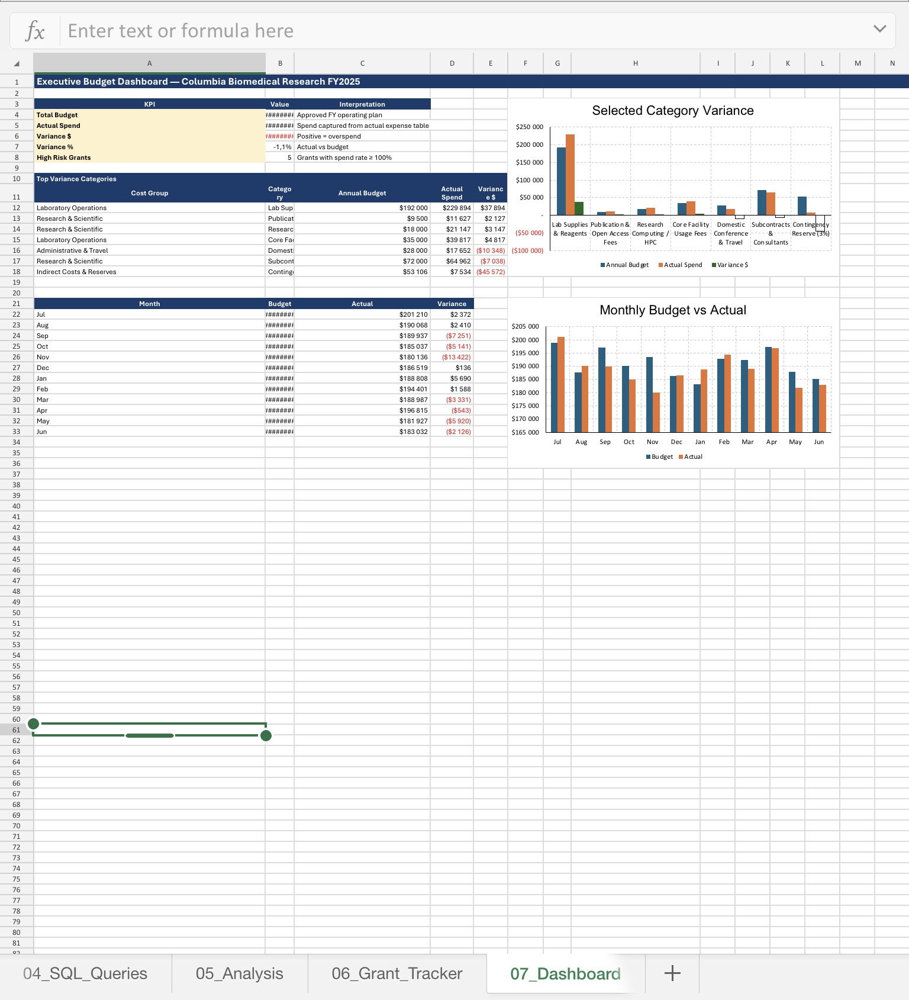
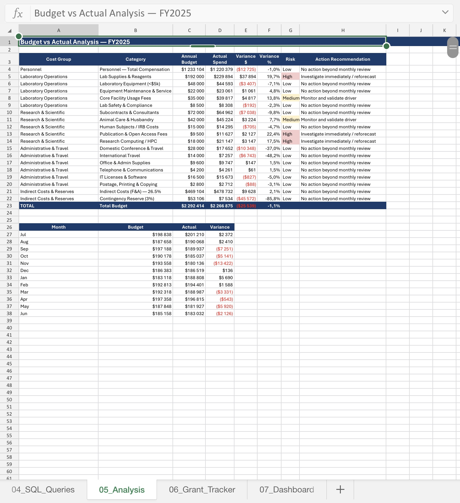
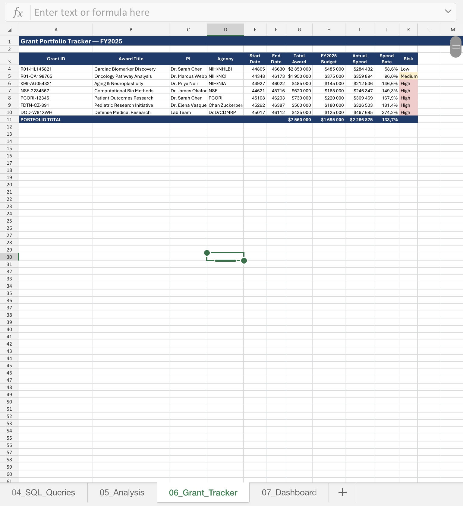

# Columbia Biomedical Research Budget Analytics (End-to-End Project)

## Overview
This project analyzes a biomedical research department’s FY2025 budget performance, tracking budget vs. actual spend, grant-level financials, and operational efficiency.

It simulates a real-world FP&A workflow using Excel, SQL, and Power BI-ready data.

---

## Business Problem
Research departments manage multiple grants and budgets.

This project answers:
- Where are we over or under budget?
- Which cost categories are driving variance?
- Which grants are at financial risk?
- What actions should finance take?

---

## Tools Used
- Excel (data modeling, assumptions, analysis)
- SQL (data schema and queries)
- Power BI (dashboard-ready outputs)

---

## Project Structure
- Assumptions & Drivers (cost structure, inflation, indirect costs)
- Raw Data (structured for SQL + BI)
- SQL Schema (relational model)
- SQL Queries (budget vs actual, trends, burn rate)
- Analysis (variance, risk, recommendations)

---

## Key Insights
- Identified overspending in personnel and lab operations
- Flagged high-risk grants with excessive burn rates
- Highlighted variance trends across months and categories
- Provided actionable recommendations for cost control

---

## Why This Project Matters
Demonstrates how finance teams use data to support budgeting, forecasting, and strategic decision-making.

---

## Author
Ofentse Kekana  
Finance & Data Analyst

## Dashboard Preview

### Executive Dashboard

### Budget vs Actual Analysis

### Grant Portfolio Tracker

